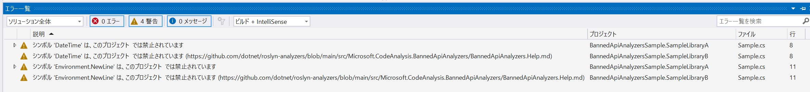

# banned-api-analyzers-sample
BannedApiAnalyzers のサンプル

## Feature
- .NET8
- BannedApiAnalyzers

## Note
- BannedApiAnalyzers を用いて、禁止クラス・メソッドを設定する例です。
- Directory.Build.props と AnalyzerRule/BannedSymbols.txt を用いて、複数プロジェクトに共通の設定を行うサンプルになっています。

### Image
